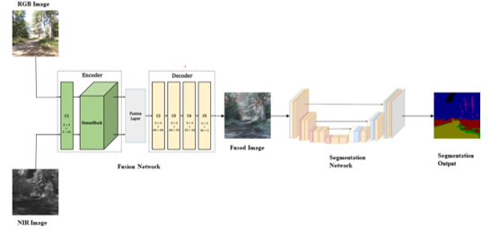
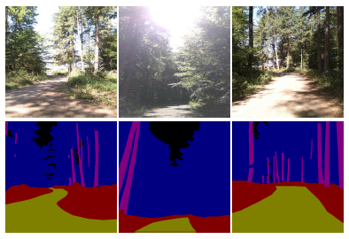
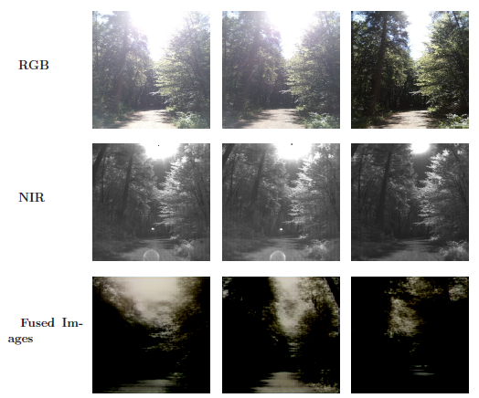
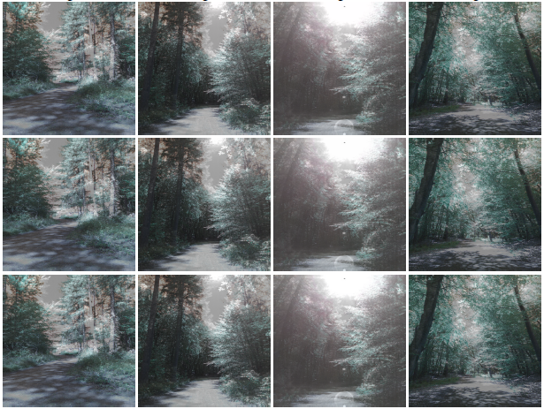
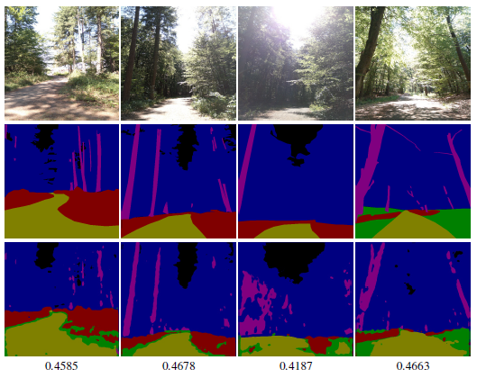
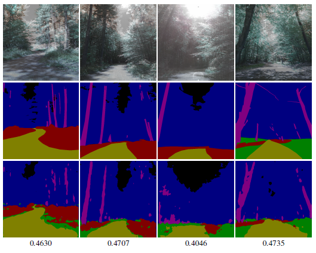

# Robust Semantic Segmentation with Fusion of RGB and NIR images

## Paper
https://ieeexplore.ieee.org/document/10597528

## Abstract
In recent years, significant progress has been made in autonomous mobility. However, this
has been highly limited to urban environments. Perception and semantic segmentation
have yet to be studied problems for Off-road autonomous mobility. Consequently, there
is only a little literature and datasets available for it. Moreover, off-road autonomous
mobility is more challenging because of various environments, illumination conditions, lack
of fixed or specific standard features, etc.

The aim is to solve the problem of semantic segmentation for autonomous
vehicles working in off-road environments. To this end, after studying some available
datasets, a new dataset called "RPTU-Forest Dataset" is created, containing RGB and NIR
images and their respective segmentation maps. This dataset is specific to the navigation
environment for which this semantic segmentation model will be used. This dataset is
specifically created to deal with various challenging environments.
Two deep-learning models were tested for semantic segmentation on the Freiburg Forest
dataset and the RPTU-Forest dataset. The results of the model were recorded with just
the RGB images. It was further attempted to solve the problem of overexposure and
shadows, which is very common in off-road environments, using the fusion of RGB and
NIR images.

Several fusion approaches were studied, and an autoencoder-based fusion approach was
tested. Along with the fusion of NIR and RGB images, the impact of some vegetationspecific
images, such as NDVI and TVI, on the fusion performance was evaluated.
After selecting one fusion approach, the deep-learning model for semantic segmentation
was again trained and tested with fused images. The test results for segmentation with
fused images were compared with those from RGB images earlier.

<b> Network Architecture </b>

## Code Base:
The implementation is done in the PyTorch and is given in this repository.

## Dataset
The experiments are performed on two datasets. 

1. [Freiburg Forest Dataset](http://deepscene.cs.uni-freiburg.de)
2. [RPTU Forest Dataset]()

For initial proof of concept, Freiburg Forest dataset was used (Results not published here). But, due to significant differences between the intended environment of use and the images in the Freiburg Forest dataset, new images were annotated. Overall, 286 images are annotated for semantic segmentation. 

The new dataset formed by these images is called RPTU-Forest dataset. The
overall dataset comprises of 6 classes including obstacle, sky, trail, grass, vegetation and void (background). Particularly important to us, was the strong variations in
illumination. An example of annotated images in the dataset is shown in the image below.

<b>Sample Annotated Images</b>

This strong changes in the illumination conditions is what makes this dataset unique it is not illustrated in the state-of-the-art datasets.

The RPTU-Forest dataset therefore consists of images captured with a Parrot Sequoia+ Multispectral Camera. Along-with RGB images, the dataset consists of NIR (Near Infrared, 790 BP 40), GREEN (550 BP 40), RED (660 BP 40) and Red-Edge (735 BP 10) channel images.

The dataset was collected in the spring. An example of an annotated image is shown below.

<b>Annotated Image Example</b>

## Results
The part of the code is mainly divided into two parts.
1. [Sensor Fusion ](SensorFusion)
2. [Semantic Segmentation](SemanticSegmentation)

For sensor fusion between two similar modalities (namely RGB and NIR image) there are multiple approaches which are tested. These approaches are:
1. [DenseFusion](SensorFusion/DenseFuse)
2. [Dual-Branch Fusion](SensorFusion/DualBranch)
3. [Variational Autoencoders](SensorFusion/VAE)

The goal of the is to check if there is any improvement in the semantic segmentation if it is trained on the output of the sensor fusion model. It is hypothesized that, if the image resulting from the fusion of RGB and NIR images should have more features that are useful for the semantic segmentation task.

### Sensor Fusion
These approaches have their own separate folders with the source code. In each folder, more information about how to run the code is given. 

The expectation was, due to the generative nature of the variational autoencoder, it will be better in recreating the images and consequently fusing the images. However, it was observed that, due to small number of images in the dataset, it was not able to properly learn the underlying distribution of the data and hence was not able to recreate the images during training phase. This also affected the performance of the fusion algorithm. The results for the image fusion using variational autoencoders are shown below.

<b>Autoencoder based image fusion results</b>

However, it was observed that, some autoencoder based algorithms perform much better in image fusion. How well an algorithm performs depends upon what kind of images are given as input (RGB, NIR, NDVI and Grey Scale) and how deep the network is. It is observed that, Dense-Fuse algorithm works better for the fusion. This algorithm was tested with RGB+NIR, RGB+NDVI image combination. The results <u><b>are not</b></u> significantly different when NIR or NDVI image are used with RGB images. The results of the Dense Fuse algorithm are shown below.

<b>DesneFuse Results</b>

Unlike DenseFuse, Dual Branch fusion which works with only gray scale images and NIR images does not perform very well in the fusion. 

### Semantic Segmentation
The RPTU-Forest dataset is split in the ration of 80%-10%-10% (train-val-test). There are two models considered for the semantic segmentation, U-Net and DeepLab-v3. These models are choosen because they are well established and proven with various datasets. Out of the two, U-Net was choosen for hte experiments because it provided with slightly better results than DeepLab-v2. This may be result of simplistic nature of the model combined with limited dataset. Limited dataset results in the overfitting of DeepLab-v3 model. 

The results and the validation dice scores for the U-Net model trained on only RGB images and fued images (RGB+NIR) are shown below.

<b>RGB Image Segmentation Results</b>

<b>Fused Image Segmentation Results</b>
